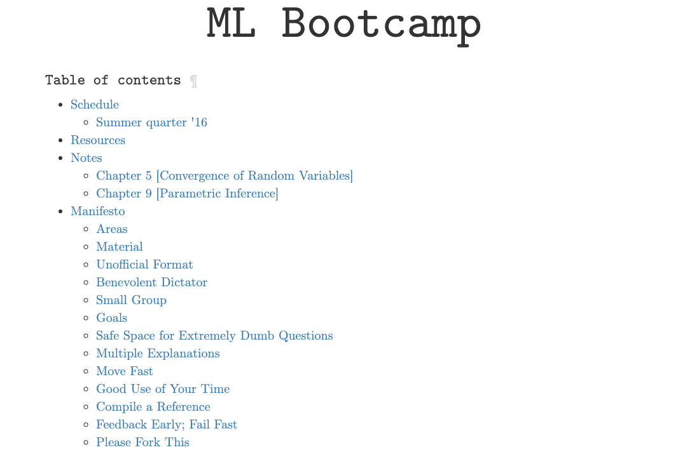

# mlbc

ML Bootcamp

This was a website I used to post some content while running "ML Bootcamp" during my
first year as a PhD student at the University of Washington.

## TODO

Consider processing mathjax on the server for quicker loads:
-	https://www.npmjs.com/package/markdown-it-math
-	https://github.com/mathjax/MathJax-node
